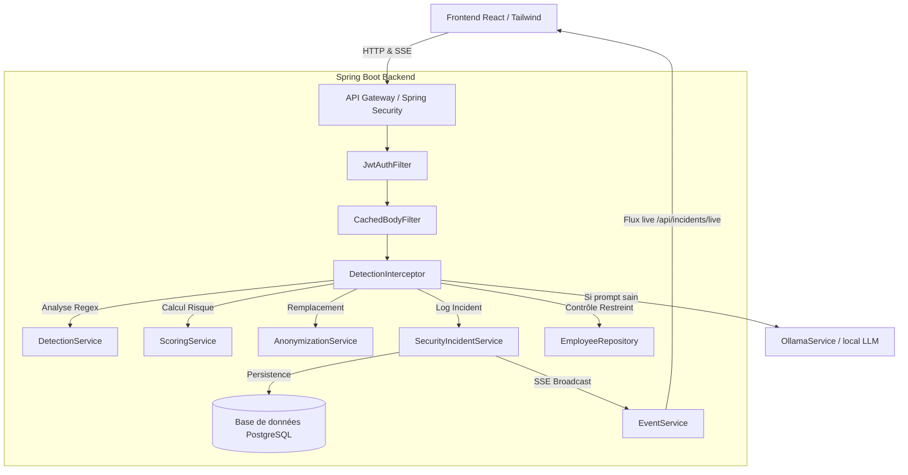
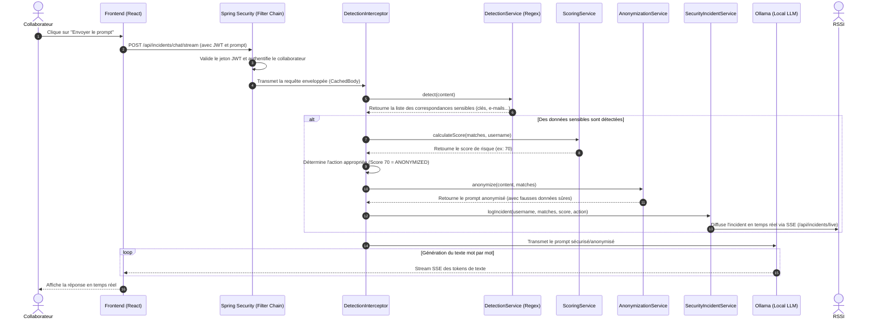
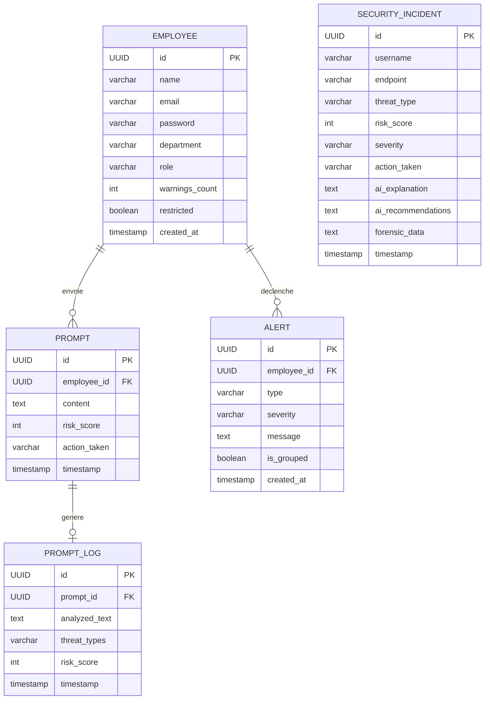

# SafeRaqib — PromptGuard

SafeRaqib est une plateforme de sécurité SaaS d'entreprise de pointe conçue pour protéger les données confidentielles lors de l'utilisation d'assistants d'Intelligence Artificielle. Elle offre une alternative locale sécurisée aux solutions grand public (comme ChatGPT ou Claude) tout en analysant, filtrant, et contrôlant en temps réel les données exposées par les collaborateurs.

---

## 👁️ Vision du projet

Dans un monde où les grands modèles de langage (LLM) sont devenus des outils quotidiens de productivité, les entreprises font face à un risque majeur : **la fuite involontaire de données sensibles** (données personnelles, identifiants système, secrets industriels, clés d'API). 

SafeRaqib résout ce problème en s'imposant comme un proxy intelligent de sécurité (**AI Firewall**) positionné entre l'utilisateur et l'intelligence artificielle locale.
* **Souveraineté & Sécurité :** Une IA locale basée sur Mistral / Llama 3.2 via Ollama garantit qu'aucune donnée ne quitte l'infrastructure de l'entreprise.
* **Interception Proactive :** Un moteur d'analyse statistique et syntaxique filtre les prompts avant même qu'ils ne soient traités par le LLM.
* **Supervision temps réel :** Le RSSI dispose d'un tableau de bord de type SOC (Security Operations Center) pour auditer les accès, visualiser les menaces et bloquer les utilisateurs en infraction.

---

## 🏗️ Architecture technique

L'application repose sur une architecture moderne à deux niveaux :



* **Frontend :** Single Page Application bâtie avec **React.js**, **Framer Motion** pour des micro-animations immersives, et **TailwindCSS** pour une interface sombre (Dark Mode) ultra-soignée.
* **Backend :** API REST performante propulsée par **Spring Boot 3.2.5** et **Java 17**.
* **Base de données :** Persistance relationnelle via **PostgreSQL** avec mapping objet-relationnel géré par **Spring Data JPA / Hibernate**.
* **Moteur d'IA :** Orchestration de conteneurs IA locaux via **Ollama**.

---

## 🛠️ Fonctionnalités implémentées

### 1. Authentification & Sécurisation par Token JWT
* **Pourquoi ?** 
  Pour garantir qu'aucun prompt ne peut être soumis de manière anonyme et non traçable. L'application identifie formellement chaque utilisateur pour associer son comportement et ses risques de sécurité.
* **Comment ?**
  L'authentification s'appuie sur le framework Spring Security. Lors de la connexion, le backend valide les identifiants en base et génère un jeton cryptographique JWT auto-porteur via la classe `JwtUtil.java`. Chaque requête ultérieure vers l'API est interceptée et analysée par `JwtAuthFilter.java` pour extraire et valider l'utilisateur.
  > ⚠️ **Note de conformité :** La génération et le parsing des jetons sont 100% opérationnels. La structure hiérarchique RBAC complète est simplifiée au niveau du filtre pour ce prototype, se basant sur le rôle stocké en base de données.
* **Processus pas à pas :**
  1. Le client envoie une requête POST contenant l'email et le mot de passe sur `/api/auth/login`.
  2. Le serveur cherche l'employé dans `EmployeeRepository` et valide son mot de passe.
  3. En cas de succès, `JwtUtil` génère un jeton JWT contenant l'email de l'utilisateur comme *Subject* et une date d'expiration de 24h.
  4. Le token est retourné dans le corps de réponse JSON.
  5. Pour les requêtes suivantes, le client ajoute l'en-tête `Authorization: Bearer <token>`. Le filtre `JwtAuthFilter` l'intercepte, extrait le sujet, charge le contexte de sécurité (`SecurityContextHolder`), et transmet la requête à la chaîne de filtres.
* **Exemple concret (cURL) :**
  ```bash
  curl -X POST http://localhost:8080/api/auth/login \
    -H "Content-Type: application/json" \
    -d '{"email":"alice@saferaqib.corp", "password":"securePassword123"}'
  ```
  **Réponse JSON :**
  ```json
  {
    "token": "eyJhbGciOiJIUzI1NiJ9.eyJzdWIiOiJhbGljZUBzYWZlcmFxaWIuY29ycCIsImlhdCI6MTcxNTk4MDgwMCwiZXhwIjoxNzE2MDY3MjAwfQ...",
    "employeeId": "a1b2c3d4-e5f6-7a8b-9c0d-1e2f3a4b5c6d",
    "name": "Alice Dev",
    "department": "R&D",
    "role": "ROLE_EMPLOYEE",
    "restricted": false
  }
  ```

---

### 2. Moteur Proactif de Détection et d'Anonymisation
* **Pourquoi ?**
  Pour empêcher les informations ultra-confidentielles d'être envoyées au modèle de langage en clair. Cela permet de bloquer les violations de sécurité et d'anonymiser automatiquement les données identifiables (RGPD).
* **Comment ?**
  * **Interception :** Toutes les requêtes HTTP contenant des prompts de chat passent par le filtre `CachedBodyFilter.java` qui copie le flux d'entrée de la requête dans un wrapper `CachedBodyHttpServletRequestWrapper`. Cela permet de lire le corps du prompt plusieurs fois (d'abord pour l'analyse par l'intercepteur, puis par le contrôleur).
  * **Analyse :** La classe `DetectionInterceptor.java` intercepte la requête avant d'entrer dans le contrôleur. Elle appelle le service `DetectionService.java` qui applique des expressions régulières (Regex) ultra-rapides et ciblées pour détecter des schémas connus (clés AWS, OpenAI, Stripe, jetons JWT, adresses IP privées, e-mails, identifiants de bases de données, variables d'environnement secrètes).
  * **Scoring & Pénalité :** `ScoringService.java` attribue un score de risque pondéré à chaque type de menace détecté. Il applique également un **algorithme d'apprentissage adaptatif** en pénalisant les récidivistes (+10% de score de risque par incident historique enregistré en base pour cet utilisateur, plafonné à +50%).
  * **Action corrective :**
    * **Score < 50 (Risque faible) :** Prompt autorisé.
    * **Score 50-85 (Risque modéré) :** Le prompt est automatiquement altéré par `AnonymizationService.java`. Les données sensibles détectées sont remplacées par des faux-semblants réalistes (ex: `user_demo@company-demo.com` pour un email).
    * **Score > 85 (Risque critique) :** La requête est immédiatement avortée avec un code HTTP `403 Forbidden`.
  > ⚠️ **Note technique :** L'intégration des API Groq et LLM cloud tiers pour la détection sémantique est simulée pour ce MVP afin de garantir une exécution 100% locale, rapide et sans dépendance externe instable.
* **Processus pas à pas :**
  1. L'employé saisit un prompt contenant : *"Voici ma clé `sk-53gfhjDGSd764gjhgds87F`"*
  2. Le `CachedBodyFilter` intercepte le corps de la requête.
  3. Le `DetectionInterceptor` extrait le texte et le soumet à `DetectionService.detect()`.
  4. La Regex `sk-[a-zA-Z0-9]{20,}` repère la clé OpenAI (poids de risque de 40 points).
  5. `ScoringService` calcule le score final. Si l'utilisateur a 2 antécédents, le multiplicateur s'applique : `40 * 1.2 = 48` points.
  6. Le score est de 48 (< 50). L'action décidée est `ALLOWED`. Le prompt passe au contrôleur sans modification. Si le score avait été de 65, le prompt aurait été modifié par `AnonymizationService` pour remplacer la clé par un placeholder syntaxique valide avant transmission à Ollama.
* **Exemple concret (Prompt Anonymisé) :**
  * **Prompt original envoyé par le client :**
    > *"Peux-tu optimiser cette connexion ? `jdbc:postgresql://192.168.1.45:5432/production_db?user=admin&pass=secret`"*
  * **Prompt reçu et exécuté par Ollama :**
    > *"Peux-tu optimiser cette connexion ? `jdbc:postgresql://localhost:5432/fake_db`"*

---

### 3. Système d'Alertes temps réel & Logique de groupement
* **Pourquoi ?**
  Pour alerter le RSSI à la seconde près lors d'un incident afin de lui permettre d'intervenir immédiatement.
* **Comment ?**
  * **Enregistrement :** Chaque incident détecté génère une ligne en base de données via `SecurityIncidentService.java` avec les recommandations IA associées au type de menace.
  * **Logic de Groupement (Corrélation) :** Pour éviter d'inonder le SOC RSSI avec des alertes mineures répétitives de développement, `AlertService.java` analyse l'historique de l'employé lors de chaque incident mineur. Si **3 alertes mineures ou plus** sont émises par le même employé dans un intervalle d'**une heure**, le système effectue une corrélation intelligente et génère automatiquement une alerte majeure (`MAJOR_ALERT`) consolidée en BDD.
  * **Notification SSE :** L'alerte consolidée ou unitaire est instantanément poussée au client connecté au flux Server-Sent Events (SSE) `/api/alerts/live`.
  > ⚠️ **Note de conformité :** La persistance en BDD, la corrélation par lot de 3 alertes/1 heure et le broadcast temps réel SSE fonctionnent parfaitement. L'escalade matérielle par e-mail direct ou SMS est simulée en logs (Mocks de `NotificationService`).
* **Processus pas à pas :**
  1. Un employé déclenche un incident de bas niveau (ex: envoi de son email professionnel dans le chat).
  2. L'incident est logué et une alerte de type `MINOR` est enregistrée.
  3. `AlertService` effectue une requête JPA : `findByEmployeeIdAndSeverityAndCreatedAtAfter(employeeId, "MINOR", oneHourAgo)`.
  4. Si la base renvoie 3 lignes, une nouvelle alerte de type `GROUPED_ALERT` (niveau `MAJOR`) est instanciée : *"Alerte de groupe : 3 alertes mineures détectées en moins d'1h..."*
  5. Cette alerte majeure est diffusée dans la liste des écouteurs SSE actifs.
* **Exemple de payload diffusé en temps réel (SSE) :**
  ```json
  event: alert
  data: {
    "id": 142,
    "type": "GROUPED_ALERT",
    "severity": "MAJOR",
    "employeeId": "a1b2c3d4-e5f6-7a8b-9c0d-1e2f3a4b5c6d",
    "message": "Alerte de groupe : 3 alertes mineures détectées en moins d'1h. Escalade au niveau MAJOR.",
    "grouped": true,
    "createdAt": "2026-05-18T00:30:12"
  }
  ```

---

### 4. Flux de Données et Stream SSE
* **Pourquoi ?**
  Les LLM prennent du temps pour générer des réponses complètes. Les serveurs bloquent souvent la connexion si le temps d'attente dépasse 30 secondes. L'utilisation du streaming Server-Sent Events (SSE) permet de pousser la réponse de l'IA mot par mot au client, améliorant radicalement l'expérience utilisateur et éliminant les délais d'attente HTTP.
* **Comment ?**
  Le contrôleur `EventController.java` gère l'endpoint `/api/incidents/chat/stream`. Il vérifie le statut de l'employé dans `EmployeeRepository`. Si son accès est restreint par le RSSI (champ `restricted` à true en BDD), la connexion est immédiatement rejetée avec une erreur HTTP `403 Forbidden` contenant un JSON explicatif. Sinon, le prompt est inspecté pour des données sensibles. S'il est validé ou anonymisé, il est transmis à `OllamaService.java` qui ouvre une connexion de flux vers le modèle local et diffuse les tokens mot à mot vers l'instance `SseEmitter` du client.
* **Processus pas à pas :**
  1. Le client envoie une requête POST sur `/api/incidents/chat/stream`.
  2. Spring Security valide le jeton JWT.
  3. `EventController` extrait le nom d'utilisateur et charge son statut. Si `restricted == true`, la requête est rejetée en 403.
  4. Le prompt est analysé. Si aucun blocage critique n'est activé, `OllamaService.streamResponse` est invoqué.
  5. Le service interroge le LLM local (Mistral) et renvoie les fragments de texte générés en continu via l'objet `SseEmitter` au format natif Event-Stream.
* **Exemple de flux reçu par le frontend :**
  ```
  data: {"content": "La"}
  data: {"content": " sécurité"}
  data: {"content": " informatique"}
  data: {"content": " est"}
  data: {"content": " primordiale."}
  ```

---

## 🔄 Flux complet de traitement d'un prompt

Voici le parcours détaillé à travers l'architecture de SafeRaqib lorsqu'un collaborateur soumet un message au chat sécurisé :



---

## 📊 Endpoints API Disponibles

Le serveur expose des API sécurisées par jeton JWT. Les endpoints principaux sont synthétisés ci-dessous :

| Méthode | Route | Authentification | Description |
| :--- | :--- | :--- | :--- |
| **POST** | `/api/auth/login` | 🔓 Publique | Authentifie un collaborateur et retourne un jeton JWT. |
| **POST** | `/api/incidents/chat/stream` | 🔐 JWT requis | Analyse le prompt, applique la sécurité et diffuse la réponse de l'IA locale (Mistral/Llama). |
| **GET** | `/api/incidents/live` | 🔐 JWT requis | Connexion SSE temps réel pour diffuser les alertes et événements de sécurité au RSSI. |
| **GET** | `/api/alerts/live` | 🔐 JWT requis | Flux SSE en temps réel diffusant les notifications d'incidents et alertes corrélées. |
| **GET** | `/api/dashboard/stats` | 🔐 JWT requis (RSSI) | Statistiques globales (total prompts analysés, bloqués, score moyen de l'entreprise). |
| **GET** | `/api/dashboard/logs` | 🔐 JWT requis (RSSI) | Historique complet et paginé des logs et détections. |
| **GET** | `/api/dashboard/incidents-by-department` | 🔐 JWT requis (RSSI) | Répartition statistique des menaces et blocages par département de l'entreprise. |
| **GET** | `/api/security/incidents` | 🔐 JWT requis (RSSI) | Liste brute détaillée des incidents de sécurité pour analyse forensic. |
| **POST** | `/api/dashboard/employees/{id}/warn` | 🔐 JWT requis (RSSI) | Envoie manuellement un avertissement de sécurité formel à l'employé ciblé. |
| **POST** | `/api/dashboard/employees/{id}/restrict` | 🔐 JWT requis (RSSI) | Restreint définitivement l'accès au Chat IA pour l'employé (bloqué côté serveur). |
| **POST** | `/api/dashboard/employees/{id}/unrestrict` | 🔐 JWT requis (RSSI) | Rétablit l'accès au Chat IA pour l'employé. |
| **GET** | `/api/portfolio/{id}` | 🔐 JWT (Employé/RSSI) | Récupère le portfolio professionnel généré automatiquement par l'IA via les tâches. |
| **GET** | `/api/portfolio/{id}/export` | 🔐 JWT (Employé/RSSI) | Exporte le portfolio sous forme de document PDF hautement stylisé (DM Sans). |

---

## 🗄️ Modèle de données (Base de données PostgreSQL)

La structure des tables de l'application est conçue pour stocker les entités clés de manière optimisée :



* **`employees` :** Représente les collaborateurs. Gère l'authentification, le département de rattachement, le rôle, le nombre d'avertissements de sécurité émis et l'indicateur de restriction d'accès.
* **`prompts` & `prompt_logs` :** Historisent l'activité d'interaction avec le modèle, la trace du prompt initial et les résultats d'analyses d'anonymisation ou de blocage.
* **`security_incidents` :** Enregistre les détections d'infractions critiques avec les explications générées par IA et les recommandations concrètes à destination du SOC.
* **`alerts` :** Contient les événements d'alertes diffusés sur le tableau de bord du RSSI, ainsi que les alertes corrélées (alertes majeures regroupées).

---

## 🚀 Lancement du projet

### Prérequis
* **Java 17** (SDK ou Runtime installé)
* **Node.js v18+** et **npm**
* **PostgreSQL** (Service actif avec une base nommée `promptguard`)
* **Ollama** (Installé localement avec le modèle `mistral` ou `llama3.2` pré-téléchargé)
  ```bash
  ollama run mistral
  ```

### Lancement du Backend (API Spring Boot)
1. Configurez vos variables d'environnement dans le fichier `back/src/main/resources/application.properties` (ou configurez vos accès de base de données PostgreSQL).
2. Depuis le répertoire `/back`, exécutez la commande suivante :
   ```bash
   mvn clean spring-boot:run
   ```
   Le serveur backend démarre sur le port standard **`8080`**.

### Lancement du Frontend (React Client)
1. Depuis le répertoire `/front`, installez les dépendances requises :
   ```bash
   npm install
   ```
2. Démarrez le serveur de développement local :
   ```bash
   npm run dev
   ```
   Le site client est accessible à l'adresse **`http://localhost:5173`**.

---

## ❓ Questions Fréquentes Jury (FAQ Technique)

### 1. Comment fonctionne exactement la détection de données sensibles dans les prompts ?
> **Réponse technique :** La détection repose sur un moteur hybride alliant performances et conformité. Dans notre implémentation de base, elle utilise des **expressions régulières (Regex)** ultra-rapides et ciblées configurées dans `DetectionService.java` (pour des structures strictes telles que les clés API AWS, Stripe, les jetons JWT, adresses IP privées et emails). 
> 
> L'intercepteur `DetectionInterceptor.java` analyse le corps de la requête HTTP entrante via un wrapper `CachedBodyHttpServletRequestWrapper` (qui évite l'épuisement du flux d'entrée du serveur de servlet) avant que la requête n'atteigne le contrôleur. Cela garantit une interception proactive complète en amont du modèle local.

### 2. Pourquoi avoir choisi Server-Sent Events (SSE) plutôt que des WebSockets pour le temps réel ?
> **Réponse technique :** Les WebSockets sont bidirectionnels, ce qui ajoute une surcharge de protocole (handshake complexe, connexions TCP persistantes lourdes à maintenir et à mettre à l'échelle). Notre besoin de temps réel pour le tableau de bord du RSSI est purement unidirectionnel (le serveur doit pousser les alertes de sécurité et incidents vers le client). 
> 
> Le protocole **Server-Sent Events (SSE)** (utilisant `SseEmitter` de Spring) est un standard HTTP natif et léger qui gère automatiquement la reconnexion et passe les pare-feu d'entreprise sans configuration supplémentaire, offrant ainsi une robustesse accrue et une empreinte mémoire minime côté backend.

### 3. Comment le score de risque est-il calculé et comment fonctionne l'apprentissage adaptatif ?
> **Réponse technique :** Le calcul s'exécute dans `ScoringService.java`. Chaque correspondance de type sensible a un poids (ex: 40 points pour une clé AWS, 30 points pour un token JWT, 20 points pour un email client). Ces poids sont additionnés pour former le score brut (plafonné à 100). 
> 
> Pour l'aspect **apprentissage adaptatif**, nous appliquons une pénalité aux récidivistes : nous comptons le nombre d'incidents passés de l'utilisateur en base de données (`securityIncidentRepository.countByUsername`). Chaque incident historique ajoute **+10% au score brut actuel** (jusqu'à un maximum de +50%). Si un utilisateur récidive, des fautes qui étaient initialement acceptables et anonymisées (score < 85) déclenchent automatiquement un blocage strict (score > 85).

### 4. Que se passe-t-il si le DetectionInterceptor rencontre une erreur ou échoue ?
> **Réponse technique :** Dans le bloc `try-catch` de `preHandle` dans `DetectionInterceptor.java`, si une exception inattendue survient (ex: format de payload invalide ou erreur de lecture Jackson), l'intercepteur intercepte l'erreur, la trace et **renvoie toujours `true`** pour permettre à la requête de poursuivre son cycle de vie standard. 
> 
> C'est un choix d'architecture résilient : nous favorisons la continuité de service pour que le contrôleur REST et les validations Jakarta Standard (`@Valid`) gèrent proprement les erreurs d'API et retournent des réponses HTTP 400 claires au client, plutôt que de faire crasher le servlet Web avec une erreur 500 générique.

### 5. Comment les alertes de sécurité sont-elles corrélées et groupées ?
> **Réponse technique :** La corrélation se produit lors de l'enregistrement d'une alerte mineure (`MINOR`). Dans `AlertService.createAlert()`, nous interrogeons la base via une requête JPA pour chercher toutes les alertes mineures de ce même collaborateur créées dans la dernière heure : `alertRepository.findByEmployeeIdAndSeverityAndCreatedAtAfter(employeeId, "MINOR", oneHourAgo)`.
> 
> Si le nombre d'alertes mineures est égal ou supérieur à 3, le système instancie et persiste une alerte de niveau supérieur (`MAJOR`) nommée `GROUPED_ALERT` regroupant l'ensemble de ces infractions. Cette alerte consolidée est immédiatement diffusée via le flux SSE pour avertir l'analyste SOC du comportement suspect répété du collaborateur.

### 6. Quelles données sont stockées en base et comment gérez-vous la conformité RGPD ?
> **Réponse technique :** Nous stockons les informations d'identification des employés (`Employee`), l'historique d'infraction (`SecurityIncident`), et les alertes (`Alert`). Pour les prompts soumis (`Prompt` & `PromptLog`), nous sauvegardons l'état analysé et le score de risque. 
> 
> Concernant la conformité RGPD :
> 1. Les prompts d'utilisateurs sains ne subissent aucun stockage intrusif des données confidentielles.
> 2. Les prompts qui subissent une anonymisation intermédiaire par le proxy voient leurs données identifiables remplacées par des faux-semblants réalistes **avant** d'atteindre le moteur d'IA locale ou la persistance. Aucune donnée personnelle réelle ne transite en clair ou n'est stockée dans nos bases historiques.

### 7. Comment le jeton JWT est-il validé à chaque requête HTTP ?
> **Réponse technique :** À chaque requête, le filtre d'authentification `JwtAuthFilter.java` extrait l'en-tête `Authorization`. S'il commence par `Bearer `, le filtre extrait le token et appelle `JwtUtil.extractUsername(token)`.
> 
> Si l'utilisateur est extrait avec succès et qu'il n'est pas encore présent dans le contexte de sécurité, le filtre valide le jeton (vérification de la signature cryptographique via la clé secrète HMAC-256 et vérification de la date d'expiration). Si le jeton est valide, le filtre crée un objet `UsernamePasswordAuthenticationToken` et l'enregistre dans le `SecurityContextHolder`, authentifiant formellement la requête pour le reste du cycle de traitement.

### 8. L'intégration de la restriction d'accès de l'employé est-elle proactive ?
> **Réponse technique :** Oui. Lors de l'envoi d'un prompt sur `/api/incidents/chat/stream`, l'API récupère l'identité de l'utilisateur connecté via le contexte de sécurité. Elle interroge ensuite `EmployeeRepository` pour lire l'état du champ `restricted` en base de données. 
> 
> Si `restricted == true`, l'API rejette immédiatement la demande avec un statut HTTP `403 Forbidden` avant même de démarrer l'analyse de sécurité ou d'envoyer la requête au LLM, bloquant de manière proactive et stricte l'accès à l'IA pour ce collaborateur.

### 9. Comment fonctionne l'algorithme d'anonymisation des données sensibles ?
> **Réponse technique :** L'anonymisation s'effectue dans `AnonymizationService.java`. L'algorithme trie d'abord les correspondances détectées (`SensitiveDataMatch`) par ordre décroissant de leur position de départ dans le texte. Ce tri inversé est critique : il permet de remplacer les morceaux de texte de la fin vers le début du prompt, garantissant que les index de début et de fin des correspondances précédentes restent valides lors des remplacements successifs. 
> 
> Chaque valeur originale est remplacée par une fausse valeur réaliste générée selon son type (ex: `10.0.0.1` pour une adresse IP), et ce mapping est conservé en session pour assurer une cohérence logique.

### 10. Pourquoi l'API d'export du Portfolio PDF a-t-elle besoin d'une intégration frontend spécifique ?
> **Réponse technique :** L'endpoint d'exportation `/api/portfolio/{id}/export` est entièrement sécurisé par Spring Security et nécessite le jeton d'authentification JWT sous peine de renvoyer une erreur 401. Une simple balise HTML d'ouverture de lien (`window.open`) n'est pas capable d'injecter des en-têtes HTTP personnalisés.
> 
> C'est pourquoi le frontend effectue une requête HTTP asynchrone sécurisée via notre instance `api` (qui injecte automatiquement le token JWT), demande un flux de données brutes (`responseType: 'blob'`), génère un lien local en mémoire (`URL.createObjectURL(blob)`) et déclenche dynamiquement le téléchargement dans le navigateur pour garantir une sécurité d'accès totale.
